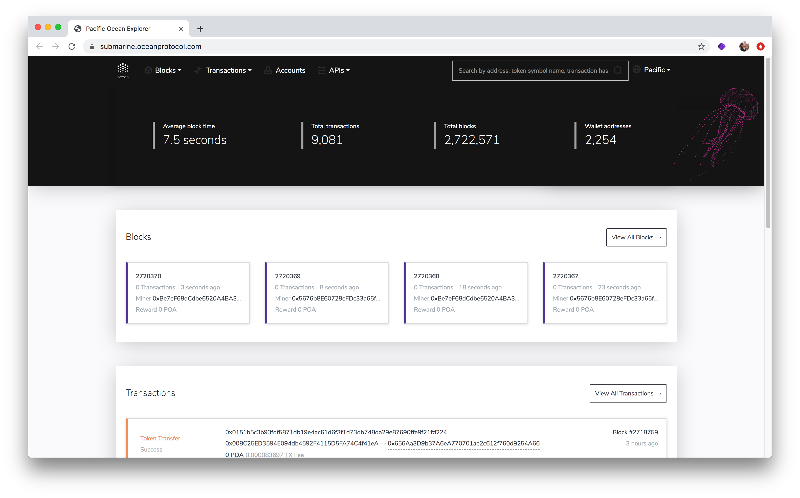

# Self-hosted BlockScout on AWS

BlockScout [Ansible Playbooks ](../../for-developers/ansible-deployment/)and the upcoming [AWS Marketplace ](../../for-developers/aws-marketplace/)integration provide several step-by-step options for deploying to AWS. This is the easiest way quickly connect BlockScout to your chain instance and get up and running quickly.

Projects may also decide to self-host on AWS and use a proxy server for additional load balancing, data caching or security.

Sites can be configured to reflect a chain's unique branding, color scheme, logos and more. See the examples below.

### Example BlockScout instances self-hosted on AWS

> **Project:** [Ocean Protocol](https://oceanprotocol.com/)  
> **BlockScout url:** [https://submarine.oceanprotocol.com](https://submarine.oceanprotocol.com)  
> **Description:** Decentralized data access and exchange protocol for AI applications.

> **Project:** [Matic](https://matic.network/)  
> **Mainnet Explorer:** [https://explorer.matic.network/](https://explorer.matic.network/)  
> **Testnet Explorers:** [https://explorer.testnet2.matic.network](https://explorer.testnet2.matic.network/) and [https://alpha-mainnet.explorer.matic.network](https://alpha-mainnet.explorer.matic.network) and [https://mumbai-explorer.matic.today/](https://mumbai-explorer.matic.today/)  
> **Description:** Sidechain scaling solution based on the Plasma framework.

> **Project:** [Fuse Network](https://explorer.fuse.io/)  
> **BlockScout URL:** [https://explorer.fuse.io](https://explorer.fuse.io)  
> **Description:** Open-source platform for economic-based community creation.

