# Manually Cleaning Terraform Related Instances


If the deployment process was previously successful, you can run  `bin/infra destroy`. Additionally, `bin/infra destroy_setup`will delete the DynamoDB table. [More information on destroying infrastructure is available here](../destroying-provisioned-infrastructure.md).

However, in circumstances that rely on insufficient AWS account rights, the deployment process may fail. In this case, `bin/infra destroy_setup` will not work. 

**Additionally, forgetting to clean resources can result in high AWS costs in a short period of time, so it's best to check that all resources have been removed.** 


In order to completely manually remove Terraform deployment from AWS you need to clear all related instances of the following services:

* S3
* CodeDeploy
* DynamoDB
* Route 53
* DynamoDB
* VPC
* RDS

### Removing S3 Buckets

1\) In the Find Services box, type in S3 and select **S3, Scalable Storage in the Cloud**.

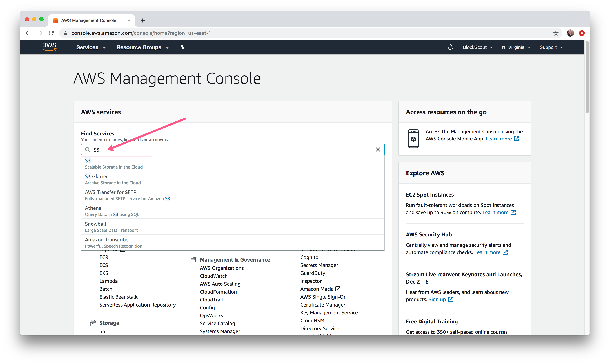

2\) Find related buckets created by Terraform one by one. You can only delete one at a time. They all will be prefixed with `${prefix}` from the Terraform config file. Select a bucket and click **Delete** button. Confirm the deletion. Continue for all related buckets.

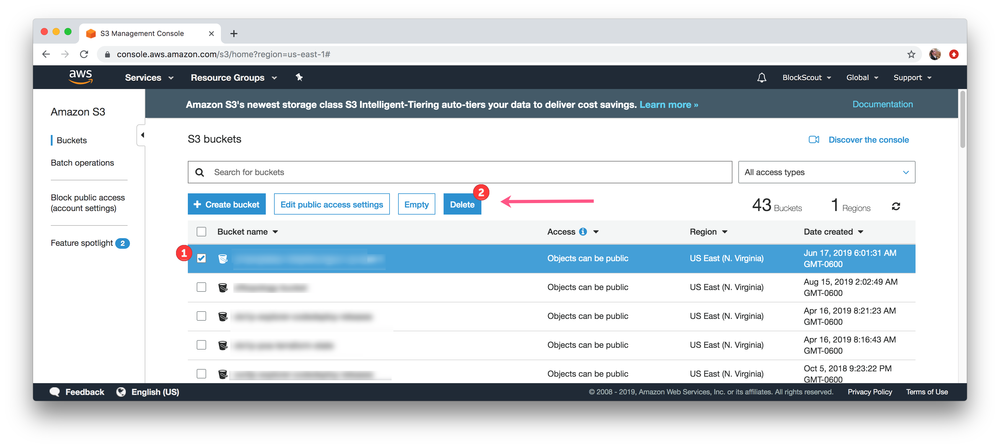

### Removing CodeDeploy Application

1\) In the Find Services box, type in **CodeDeploy** and select.

2\) Select the **Applications** section in the left menu. Click an application in the list \(related to Terraform deployment\) to select. 

Click the **Delete Application** button and confirm the deletion.

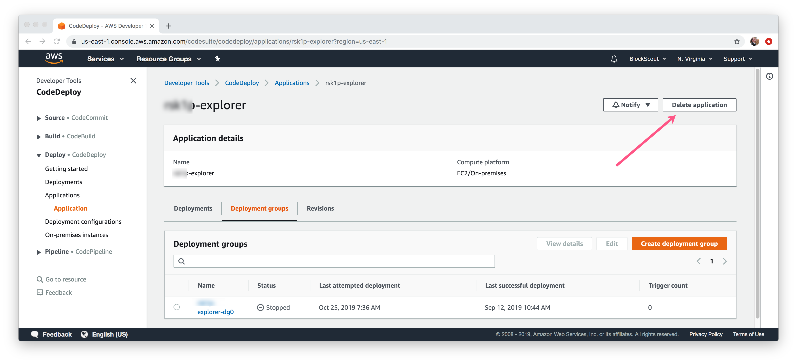

### Remove DynamoDB instance

1\) In the Find Services box, type in **DynamoDB** and select.

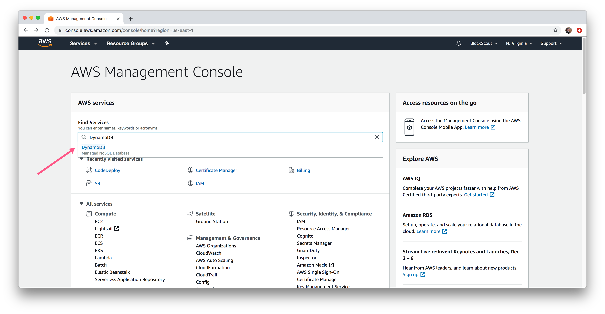

2\) Remove all related DynamoDBs. 

1. Select **Tables** section in the left menu
2. Select related database \(typically 1 database per deployment\). Select database
3.  Click **Delete Table** button. 
4. Confirm the deletion.

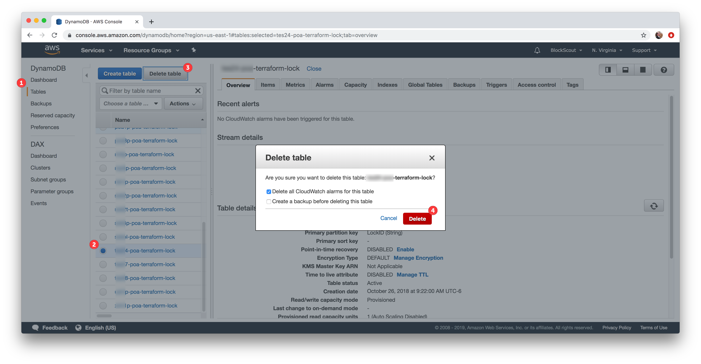

### Remove DNS \(Route 53\)

1\)  In the Find Services box, type in **Route 53** and select.

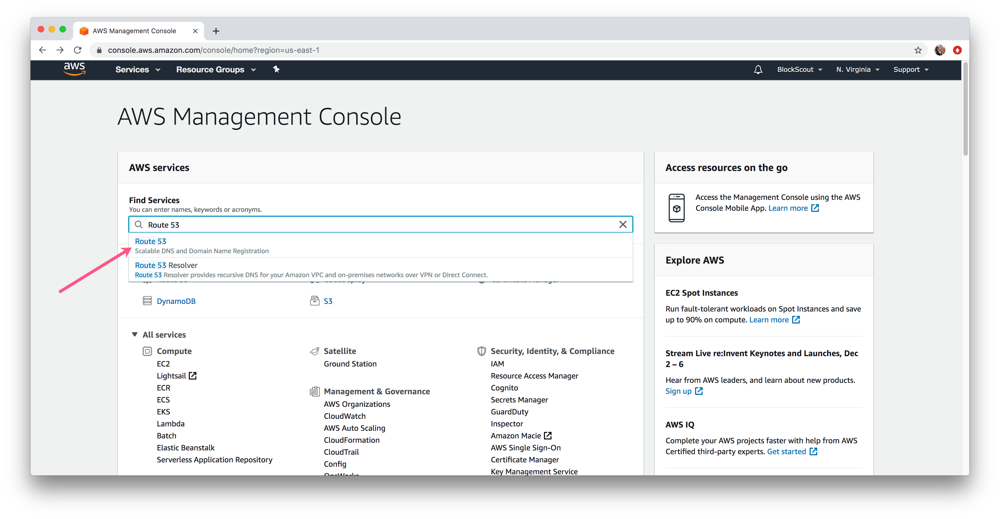

2\) Remove all related Hosted zones. 

1. Select hosted zones in left menu.
2. Select related hosted zone.
3. Click **Delete Hosted Zone** button. 
4. Confirm the deletion.

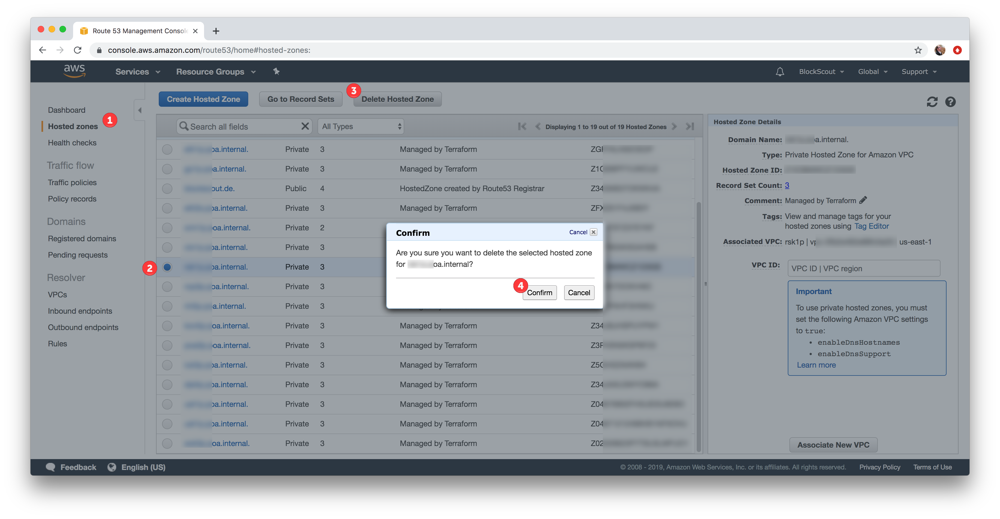

### Remove Isolated Cloud Resources \(VPC\)

1\) In the Find Services box, type in **VPC** and select.

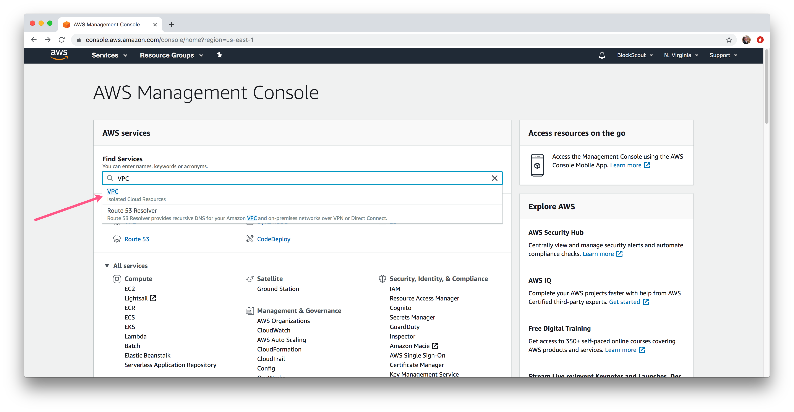

2\) Remove all related subnets. Select **Subnets** section in the left menu, select all related subnets \(usually 1 subnet per deployment\). Right mouse click or click **Delete subnet** item in **Actions** menu. Confirm the deletion.

3\) Remove all related route tables. Select **Route tables** section in the left menu, select all related route tables \(usually it should be 1 route table for deployment\). Right mouse click or click **Delete Route table** item in **Actions** menu. Confirm the deletion.

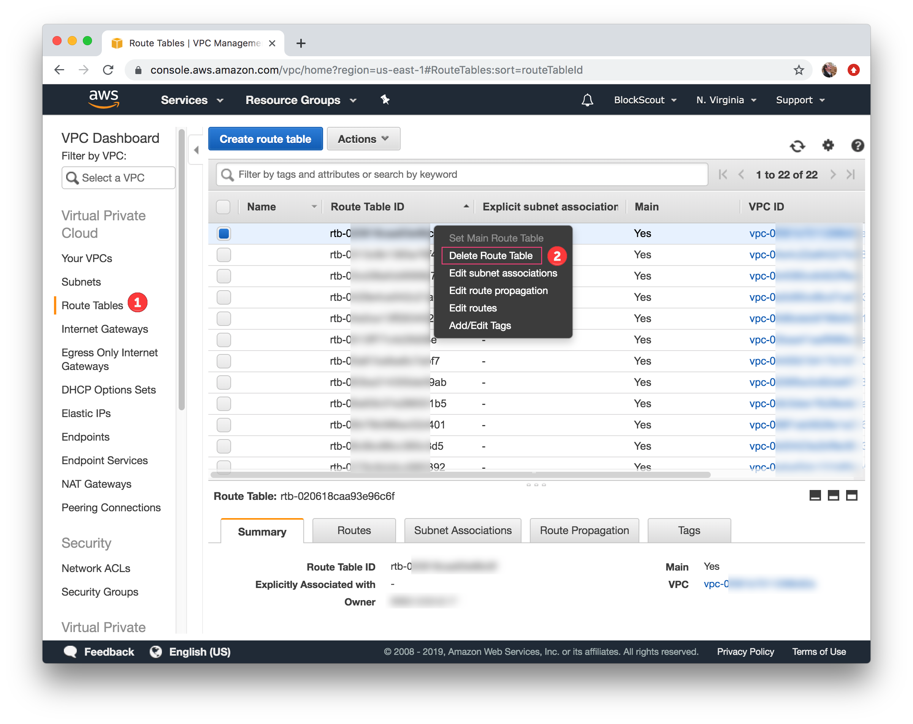

4\) Detach all related internet gateways. Select **Internet Gateways** section in the left menu, select all related internet gateways \(usually 1 internet gateway per deployment\). Right mouse click or click **Detach from VPC** item in **Actions** menu. Confirm the detachment.

5\) Remove all related DHCP options sets. Select **DHCP Options Sets** section in the left menu, select all related DHCP options sets \(usually  1 DHCP option set per deployment\). Right mouse click or click **Delete DHCP options** _set_ item in **Actions** menu. Confirm the deletion.

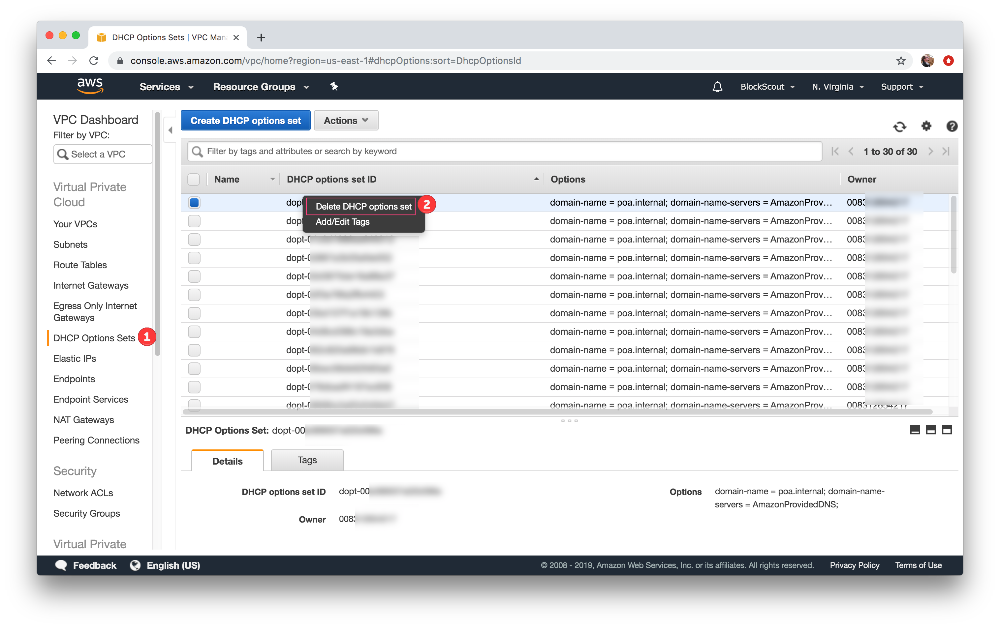

6\) Remove all related Network ACLs. Select **Network ACLs** section in the left menu, select all related Network ACLs \(usually 1 Network ACL per deployment\). Right mouse click or click **Delete network ACL** item in **Actions** menu. Confirm the deletion.

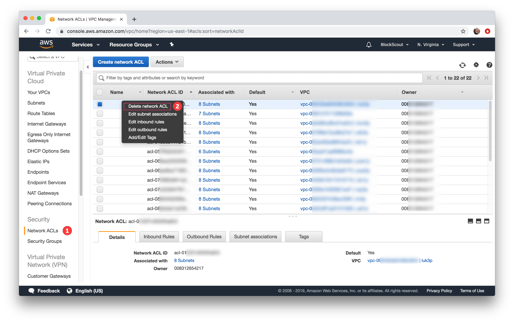

7\) Remove all related Security groups. Select **Security Groups** section in the left menu, select all related Security groups \(usually 1 Security group for deployment\). Right mouse click or click **Delete security group** item in **Actions** menu. Confirm the deletion.

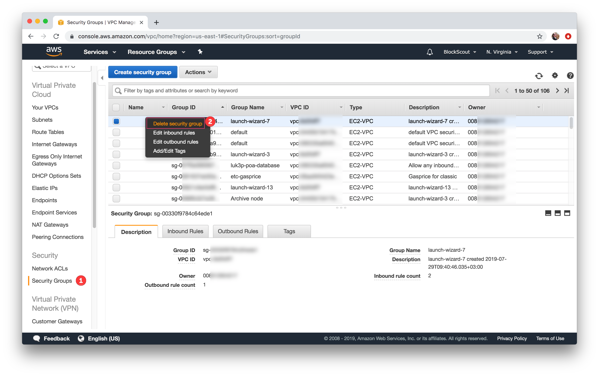

8\) Remove all related VPCs. Select **Your VPCs** section in the left menu, select all related VPCs \(usually1 VPC for deployment\). Right mouse click or click **Delete VPC** item in **Actions** menu. Confirm the deletion.

### Remove Relational Database Service \(RDS\)

1\)  In the Find Services box, type in **RDS** and select.

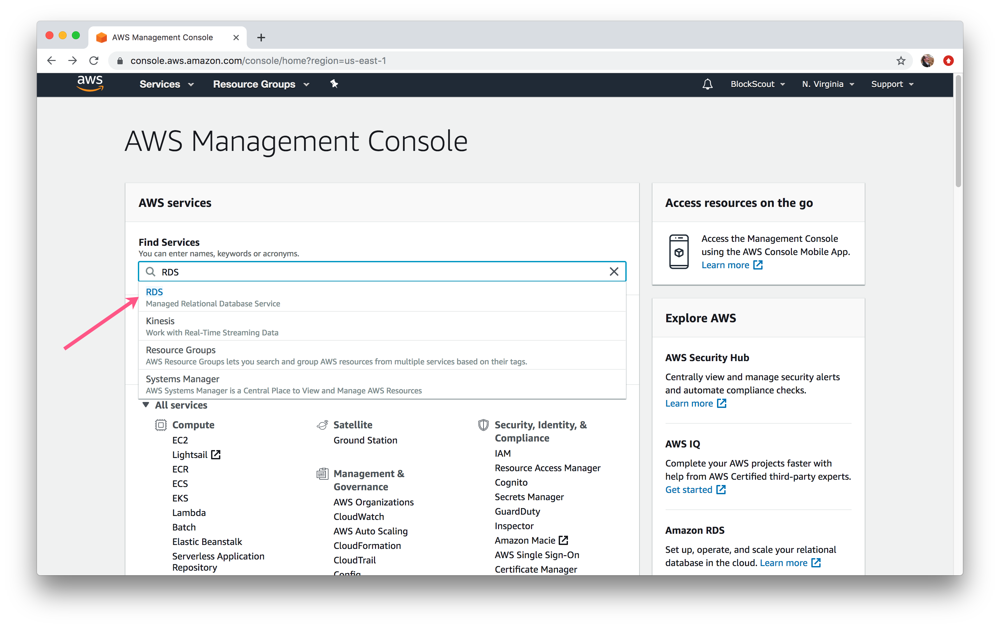

2\) Remove all related subnet groups. Select **Subnet groups** section in the left menu, select all related subnet groups \(usually  1 subnet group for deployment\). Select subnet group and click **Delete** button. Confirm the deletion.

3\) Remove all related RDSs. Select **Databases** __section in the left menu, select all related databases \(usually 1 database for deployment\). Select the Database, go to the **Actions** menu, and select **Delete** from the menu. Confirm the deletion.

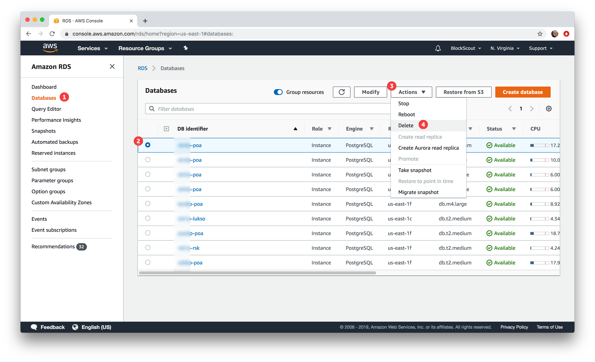


This instruction was moved from [https://forum.poa.network/t/aws-settings-for-blockscout-terraform-deployment/1962](https://forum.poa.network/t/aws-settings-for-blockscout-terraform-deployment/1962)


