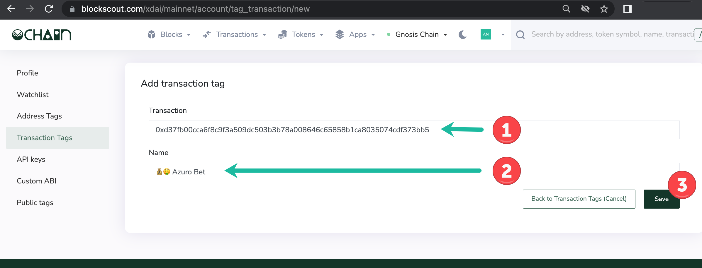
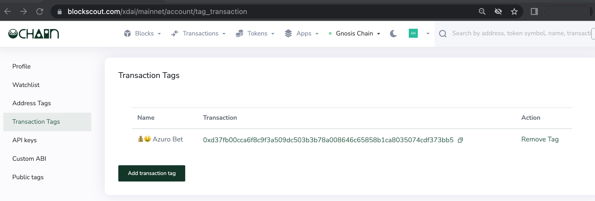
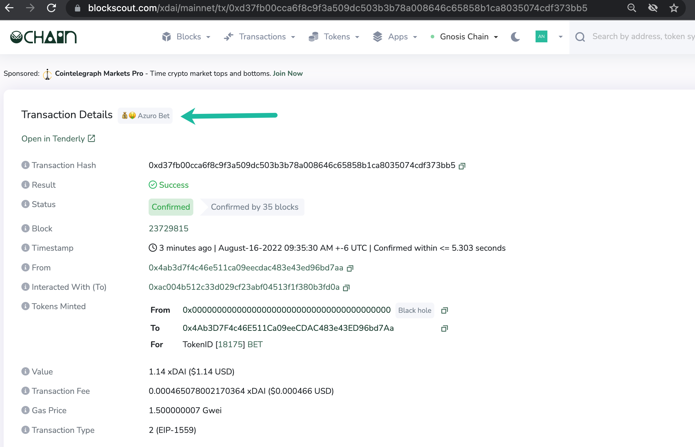

# Transaction Tags

Each transaction on a blockchain has a unique identifier called a hash. The transaction hash is created cryptographically from the details of a transaction such as the sender, receiver, value, additional data, and nonce.&#x20;

Similar to address tags, transaction tags are useful for specifying and organizing  transactions in the Blockscout interface.  When  logged in, a small grey tag will be added with the chosen name to any tagged transaction.

**1) Login to Blockscout** to create a tag.

1. Go to Transaction Tags in the user menu.
2. Press Add transaction tag.

**2)** **Fill in the fields**.

1. Transaction. Double check you are entering the correct transaction hash. Search in Blockscout to confirm.
2. Name. Create a name for the tag (35 characters or less). Emojis are a nice way to differentiate and add style and color to tags.
3. Press Save.

**3) Transaction tag added** to the Transaction Tags home screen. You can add additional tags or remove old tags from here.

**4) View tags in Blockscout**. They will appear with a grey background next to the transaction hash.


Note, you must be logged in to My Account to see your transaction tags.


