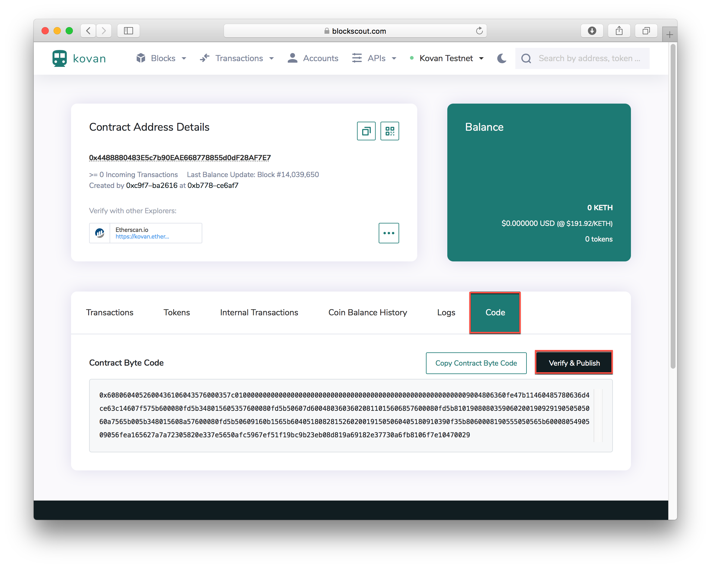

# Verifying a Smart Contract

Once verified, a smart contract or token contract's source code becomes publicly available and verifiable. This creates transparency and trust. Plus, it's easy to do!


If you are verifying on xDai chain \(or another chain with this feature implemented\) you can also use the [Sourcify integration to verify without flattening contracts](../../for-projects/premium-features/contracts-verification-via-sourcify.md).


1\) On contract creation, you will receive an address to check a pending transaction. If it does not redirect you to [blockscout.com](https://blockscout.com/), go to BlockScout, verify you are on the chain where the contract was deployed, and type the contract's address into the search bar. Your contract details should come up.  

2\) Select the `Code` tab to view the bytecode, click the **Verify & Publish** button.

3\) On the following screen, enter your contract details: 

1. **Contract Address:** The `0x` address supplied on contract creation. 
2. **Contract Name:** Name of the class whose constructor was called in the .sol file. For example, in `contract MyContract {..` **MyContract** is the contract name. 
3. **Compiler:** derived from the first line in the contract `pragma solidity X.X.X`. Use the corresponding compiler version rather than the nightly build.
4. **EVM Version:** [See EVM version information](evm-version-information.md)
5. **Optimization:** If you enabled optimization during compilation, check yes.
6. **Optimization Runs:** 200 is the Solidity Compiler default value. Only change if you changed this value while compiling.
7.  **Enter the Solidity Contract Code:** You may need to flatten your solidity code if it utilizes a library or inherits dependencies from another contract. We recommend the [POA solidity flattener](https://github.com/poanetwork/solidity-flattener) or the [truffle flattener](https://www.npmjs.com/package/truffle-flattener)\*\*\*\*
8. **Constructor Arguments:** [See this page for more info](abi-encoded-constructor-arguments.md).
9. **Libraries:** Enter the name and 0x address for any required libraries called in the called in the .sol file.
10. Click the `Verify and Publish` button.
11. If all goes well, you will see a checkmark ✅ next to Code in the code tab, and an additional tab called `Read Contract`. The contract name will now appear in BlockScout with any transactions related to your contract.

### Troubleshooting:

If you receive the dreaded `There was an error compiling your contract` message this means the bytecode doesn't match the supplied sourcecode. Unfortunately, there are many reasons this may be the case. Here are a few things to try:

1\) Double check the compiler version is correct.


Check all version digits - for example 0.5.1 is different from 0.5.10


2\) Check that an extra space has not been added to the end of the contract. When pasting in, an extra space may be added. Delete this and attempt to recompile.

3\) Copy, paste and verify your source code in Remix. You may find some exceptions here.

## 

