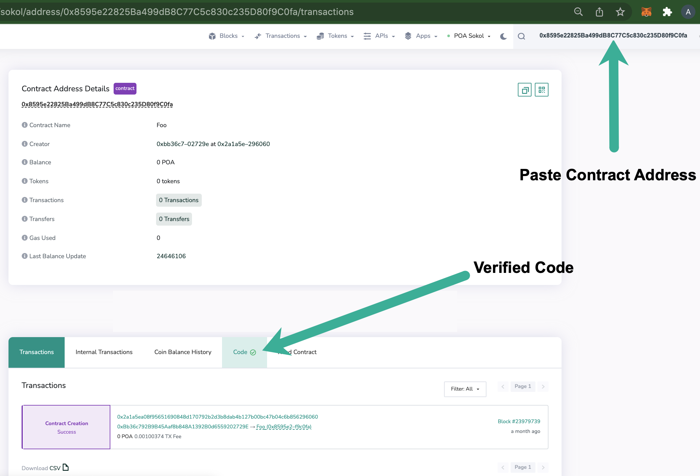

# Hardhat Verification Plugin

[Hardhat ](https://hardhat.org/)is a full-featured development environment for contract compilation, deployment and verification. The [Hardhat Etherscan plugin](https://hardhat.org/plugins/nomiclabs-hardhat-etherscan.html) supports contract verification on BlockScout.

## Get Started

### **1) Install Hardhat**

If you are starting from scratch, create an npm project by going to an empty folder, running `npm init`, and following the instructions. Recommend npm 7 or higher.

Once your project is ready:

**npm instructions**

```
npm install --save-dev hardhat
```

**yarn instructions**

```
yarn add --dev hardhat
```

### **2) Create a project**

Run `npx hardhat` in your project folder and follow the instructions to create ([more info here](https://hardhat.org/getting-started/#quick-start)).

### 3) Install plugin

Install the [hardhat-etherscan plugin](https://hardhat.org/plugins/nomiclabs-hardhat-etherscan.html) (requires **v3.0.0+).**

**npm**

```
npm install --save-dev @nomiclabs/hardhat-etherscan
```

**yarn**

```
yarn add --dev @nomiclabs/hardhat-etherscan
```

### 4) Add plugin reference to config file

Add the following statement to your `hardhat.config.js`.

```
require("@nomiclabs/hardhat-etherscan");
```

If using TypeScript, add this to your `hardhat.config.ts.` [More info on using typescript with hardhat available here](https://hardhat.org/guides/typescript.html#typescript-support).

```
import "@nomiclabs/hardhat-etherscan";
```

## Config File

Your basic [Hardhat config file](https://hardhat.org/config/) (`hardhat.config.js` or `hardhat.config.ts`) will be setup to support the network you are working on. In this example we use the Sokol test network and a `.js` file. &#x20;

Here we add an RPC url without an API key, however some value is still required. You can use any arbitrary string. [More info](https://hardhat.org/plugins/nomiclabs-hardhat-etherscan.html#multiple-api-keys-and-alternative-block-explorers).

If you prefer, you can migrate to [hardhat-toolbox](https://hardhat.org/hardhat-runner/plugins/nomicfoundation-hardhat-toolbox) to use a plugin bundle.

```
require("@nomiclabs/hardhat-waffle");
require("@nomiclabs/hardhat-etherscan");
require('hardhat-deploy');

let secret = require("./secret");

module.exports = {
  solidity: "0.8.9",
  networks: {
    sokol: {
      url: 'https://sokol.poa.network/',
      accounts: [secret.key],
    }
  },
  etherscan: {
    // Your API key for Etherscan
    // Obtain one at https://etherscan.io/
    apiKey: "abc"
  }
};
```

### Add an Unsupported Network

Some chains are not supported by the plugin (to check run `npx hardhat verify --list-networks`)

If your chain is not in the list, you can add a `customChains` object to the config file. It includes:

* `chainID` - Network chain ID
* `apiURL` - Block explorer API URL
* `browserURL` - Block explorer URL


&#x20;Find an extensive list of ChainIDs at [https://chainlist.org/](https://chainlist.org/).


For example, if Sokol were not in the default list, this is how it would be added to the config file. Note the network name in `customChains` must match the  network name in the `apiKey` object.

```
etherscan: {
  apiKey: {
    sokol: "abc"
  },
  customChains: [
    {
      network: "sokol",
      chainId: 77,
      urls: {
        apiURL: "https://blockscout.com/poa/sokol/api",
        browserURL: "https://blockscout.com/poa/sokol"
      }
    }
  ]
}
```

## Deploy and Verify

### Deploy

```
D:\hard_hat>npx hardhat run scripts\deploy.js --network sokol
Contract deployed to: 0x8595e22825Ba499dB8C77C5c830c235D80f9C0fa
```

### Verify

You can include constructor arguments with the verify task.

```
npx hardhat verify --network <network> DEPLOYED_CONTRACT_ADDRESS "Constructor argument 1"
```

Sokol example (no constructors).

```bash
D:\hard_hat>npx hardhat verify --network sokol 0x8595e22825Ba499dB8C77C5c830c235D80f9C0fa 
Nothing to compile
Compiling 1 file with 0.8.0
Successfully submitted source code for contract
contracts/test.sol:Foo at 0x8595e22825Ba499dB8C77C5c830c235D80f9C0fa
for verification on Etherscan. Waiting for verification result...

Successfully verified contract Foo on Etherscan.
https://blockscout.com/poa/sokol/address/0x8595e22825Ba499dB8C77C5c830c235D80f9C0fa#code
```


Note the verify task will not be listed in the available tasks lists at `npx hardhat --config` but should work as expected.

If not, check you have the minimum required version of the nomiclabs-hardhat-etherscan plugin (v3.0.0+) installed


## Confirm Verification on BlockScout

Go to your BlockScout instance and paste the contract address into the search bar. If verified, the code tab will display a green checkmark.



**Selecting the Code tab will provide additional information about your contract.**


## FAQ

<details>

<summary>I am using an <a href="https://github.com/OpenZeppelin/openzeppelin-upgrades">OpenZeppelin upgrades plugin implementation</a> and receive an error on proxy contract verification. What should I do?</summary>

Although you receive an error, the contracts should be verified during the previous steps and you can ignore. Check in the explorer to make sure the contracts have been verified.&#x20;

</details>

## Resources


Learn more about plugin configs, troubleshooting etc. at [https://hardhat.org/plugins/nomiclabs-hardhat-etherscan.html](https://hardhat.org/plugins/nomiclabs-hardhat-etherscan.html)

