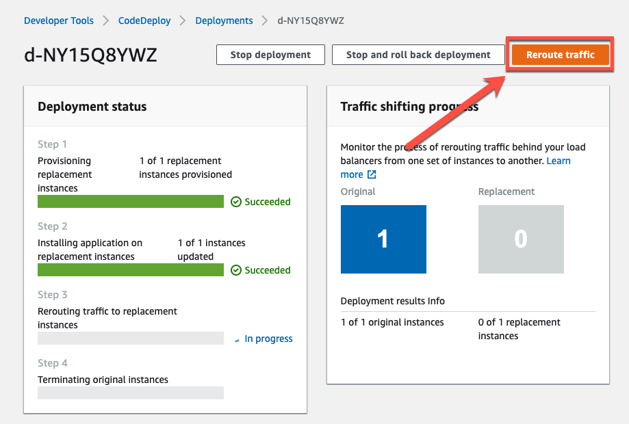
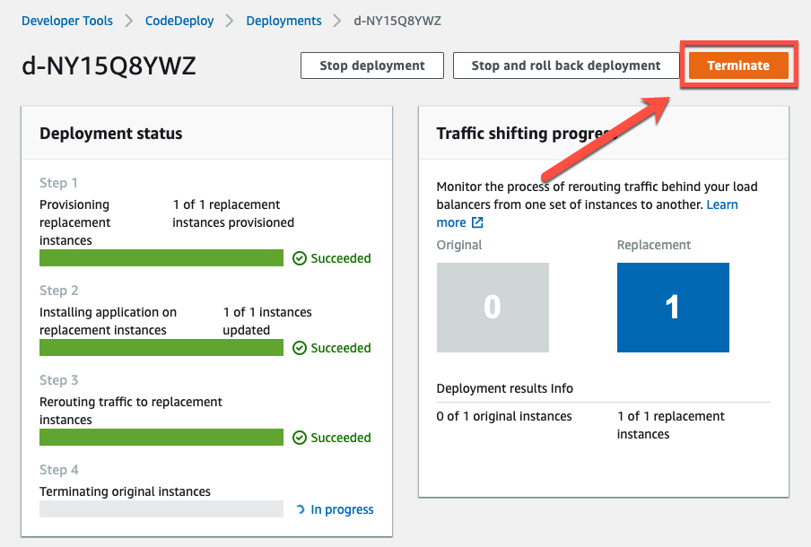

# How do I manage deployment with AWS CodeDeploy?

1\) Visit CodeDeploy in AWS. You will see a list of your deployments. Select the deployment id to view details `https://console.aws.amazon.com/codesuite/codedeploy/deployments?region=us-east-1`

2\) Deployment status consists of several steps. Once step 2 is complete \(application is installed on replacement instances\), you manually reroute traffic. Click the `Reroute traffic` button to initiate.

3\) Once traffic is rerouted, you’ll be asked to terminate the original instance. Click the **Terminate** button to initiate.

4\) Once complete, use the public DNS address of the Amazon EC2 instance to view in a web browser. \(To get the public DNS value, choose your Amazon EC2 instance in the Amazon EC2 console, and look for the value in **Public DNS i**n the **Description** tab\).


This instruction was moved from: [https://forum.poa.network/t/monitor-and-manage-a-blockscout-deployment-using-codedeploy-in-your-aws-console/2499](https://forum.poa.network/t/monitor-and-manage-a-blockscout-deployment-using-codedeploy-in-your-aws-console/2499)


